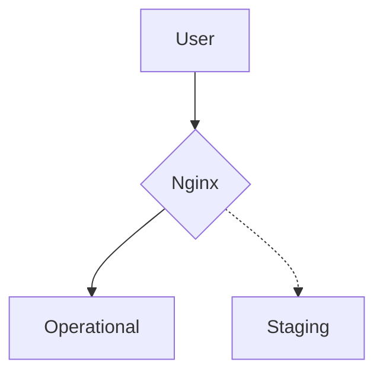

Using a staging environment for your website is considered a basic good practice today. In order for this environment to fully simulate the operational environment, we need to make sure that every HTTP request sent to the operational environment is mirrored to the staging environment. We also need that neither the stability nor failure of the staging environment will affect the original request, so that the end users will not ‘feel’ the mirroring at all.

Fortunately, [Nginx](https://nginx.org) (my go-to webserver for production, which is also the number one server for the busiest websites in the world as of 2022) has a [built-in mirroring module](https://nginx.org/en/docs/http/ngx_http_mirror_module.html) that can accomplish this task without any third-party dependencies. In this article, we will learn how to use Nginx’s mirroring module to mirror HTTP requests from an operational environment to a staging environment. We will also explore how to test the mirroring configuration to ensure it works as expected.

### Setup

<figure class="align-center">

  <figcaption>Flowchart of the mirroring</figcaption>
</figure>

First, let's create two dummy servers with Node.js. One server will act as the operational environment and the other server will act as the staging environment. Both servers will return a simple 200 response; later on we will deal with more problematic configurations.

**Operational server `(operational.js)`**

```javascript
const express = require("express");

const app = express();

app.get("/", (req, res) => {
  console.log("Request body:", req.body);
  console.log("Request headers:", req.headers);
  res.send("Hello, operational!");
});

app.listen(3000, () => {
  console.log("Operational server listening on port 3000");
});
```

**Staging server `(staging.js)`**

```javascript
const express = require("express");

const app = express();

app.get("/", (req, res) => {
  console.log("Request body:", req.body);
  console.log("Request headers:", req.headers);
  res.send("Hello, staging!");
});

app.listen(3001, () => {
  console.log("Staging server listening on port 3001");
});
```

Let's create a mirroring configuration for Nginx.

```conf
worker_processes  5;
worker_rlimit_nofile 8192;

events {
  worker_connections  4096;
}

http {

  upstream operational {
    server operational:3000;
  }

  upstream staging {
    server staging:3001;
  }

  server {
    listen 80;

    location / {
      # Mirror all requests (with their body) to the /mirror location.
      mirror /mirror;
      mirror_request_body on;
      # Log all subrequests.
      log_subrequest on;
      # Proxy the request to the operational server.
      proxy_pass http://operational;
    }

    location = /mirror {
      # This location is internal, so it is not accessible to users.
      internal;
      # Proxy the request to the staging server.
      proxy_pass http://staging$request_uri;
      # Set connect and read timeouts to 200ms.
      proxy_connect_timeout 200ms;
      proxy_read_timeout 200ms;
    }
  }
}
```

This configuration will mirror all HTTP requests coming to the `/` location at the `operational` upstream, to the `/` location at the `staging` upstream.

### Testing

Now, let's test our mirroring configuration.

Create a Docker compose file to run the two servers with Nginx as a reverse proxy and mirroring activated.

```docker
services:
  operational:
    image: node:18
    command: bash -c "cd /home/node/app && npm i express && node operational.js"
    volumes:
      - ./operational.js:/home/node/app/operational.js
    ports:
      - 3000:3000
  staging:
    image: node:18
    command: bash -c "cd /home/node/app && npm i express && node staging.js"
    volumes:
      - ./staging.js:/home/node/app/staging.js
    ports:
      - 3001:3001
  nginx:
    image: nginx:stable-alpine
    ports:
      - 80:80
    volumes:
      - ./nginx.conf:/etc/nginx/nginx.conf
    depends_on:
      - operational
      - staging
```

Build and run the containers.

```bash
docker compose up
```

Accessing `localhost` should now return a response from the operational server, while in the logs you can see that the staging server also receives the request.

```
curl http://localhost
```

This should return the following output:

```
Hello, operational!
```

Now, let's check the logs of the staging server.

```
docker logs nginx
```

This should show the following output:

```
Request body: undefined
Request headers: {
  host: 'staging',
  <Additional headers...>
}
```

As you can see, the staging server received a mirrored request, sent to the operational server!


---

### Testing for Failures

Wait, we're not done just yet!  
We also want to test the mirroring configuration for failures. For this, we will create three servers:

- A server with a long delay;
- A server that always returns a 500 status code;
- A server that crashes.

We will use these servers to simulate various types of failures and verify that the mirroring configuration handles them correctly.

**Server with long delay `(delay.js)`**

```js
const express = require("express");

const app = express();

app.get("/", async (req, res) => {
  console.log("Request body:", req.body);
  console.log("Request headers:", req.headers);
  await new Promise((resolve) => setTimeout(resolve, 5000));
  res.send("Hello, staging!");
});

app.listen(3001, () => {
  console.log("Staging server listening on port 3001");
});
```

**Server that always returns 500 `(500.js)`**

```js
const express = require("express");

const app = express();

app.get("/", (req, res) => {
  console.log("Request body:", req.body);
  console.log("Request headers:", req.headers);
  res.statusCode = 500;
  res.send("Hello, staging!");
});

app.listen(3001, () => {
  console.log("Staging server listening on port 3001");
});
```

**Server that always crashes `(crash.js)`**

```js
const express = require("express");

const app = express();

app.get("/", (req, res) => {
  console.log("Request body:", req.body);
  console.log("Request headers:", req.headers);
  process.nextTick(function () {
    throw new Error();
  });
});

app.listen(3001, () => {
  console.log("Staging server listening on port 3001");
});
```

To run the tests, we can use the following command:

```bash
hey -z 10s -q 10 -n 100 -c 1 -t 1 http://localhost
```

This command sends 100 GET requests to the operational environment.

When launching the servers with Docker Compose and running the `hey` command against each server, we can see that the requests are being mirrored and answered from the operational environment:

#### Delay server

```bash
hey -z 10s -q 10 -n 100 -c 1 -t 1 http://localhost


Summary:
  Total:        10.1307 secs
  Slowest:      0.2095 secs
  Fastest:      0.0149 secs
  Average:      0.1989 secs
  Requests/sec: 4.9355

  Total data:   950 bytes
  Size/request: 19 bytes

Response time histogram:
  0.015 [1]     |■
  0.034 [0]     |
  0.054 [0]     |
  0.073 [0]     |
  0.093 [0]     |
  0.112 [0]     |
  0.132 [1]     |■
  0.151 [0]     |
  0.171 [0]     |
  0.190 [0]     |
  0.209 [48]    |■■■■■■■■■■■■■■■■■■■■■■■■■■■■■■■■■■■■■■■■


Latency distribution:
  10% in 0.1992 secs
  25% in 0.2028 secs
  50% in 0.2048 secs
  75% in 0.2066 secs
  90% in 0.2084 secs
  95% in 0.2089 secs
  0% in 0.0000 secs

Details (average, fastest, slowest):
  DNS+dialup:   0.0001 secs, 0.0149 secs, 0.2095 secs
  DNS-lookup:   0.0001 secs, 0.0000 secs, 0.0037 secs
  req write:    0.0000 secs, 0.0000 secs, 0.0001 secs
  resp wait:    0.1985 secs, 0.0065 secs, 0.2093 secs
  resp read:    0.0001 secs, 0.0000 secs, 0.0002 secs

Status code distribution:
  [200] 50 responses

```

We can see that we're getting a lot of logs that indicate that the `staging` server timed out, e.g.
`2023/05/11 20:00:40 [error] 23#23: *102 upstream timed out (110: Operation timed out) while reading response header from upstream` yet the timeouts did not have any influence on the response.

#### 500 server

```bash
hey -z 10s -q 10 -n 100 -c 1 -t 1 http://localhost

Summary:
  Total:        10.0112 secs
  Slowest:      0.0169 secs
  Fastest:      0.0035 secs
  Average:      0.0085 secs
  Requests/sec: 9.9889

  Total data:   1900 bytes
  Size/request: 19 bytes

Response time histogram:
  0.003 [1]     |■■
  0.005 [3]     |■■■■■
  0.006 [10]    |■■■■■■■■■■■■■■■■
  0.007 [17]    |■■■■■■■■■■■■■■■■■■■■■■■■■■■
  0.009 [25]    |■■■■■■■■■■■■■■■■■■■■■■■■■■■■■■■■■■■■■■■■
  0.010 [23]    |■■■■■■■■■■■■■■■■■■■■■■■■■■■■■■■■■■■■■
  0.012 [14]    |■■■■■■■■■■■■■■■■■■■■■■
  0.013 [3]     |■■■■■
  0.014 [3]     |■■■■■
  0.016 [0]     |
  0.017 [1]     |■■


Latency distribution:
  10% in 0.0059 secs
  25% in 0.0069 secs
  50% in 0.0084 secs
  75% in 0.0099 secs
  90% in 0.0114 secs
  95% in 0.0125 secs
  99% in 0.0169 secs

Details (average, fastest, slowest):
  DNS+dialup:   0.0001 secs, 0.0035 secs, 0.0169 secs
  DNS-lookup:   0.0000 secs, 0.0000 secs, 0.0038 secs
  req write:    0.0001 secs, 0.0000 secs, 0.0003 secs
  resp wait:    0.0082 secs, 0.0032 secs, 0.0136 secs
  resp read:    0.0001 secs, 0.0000 secs, 0.0006 secs

Status code distribution:
  [200] 100 responses
```

The errors did not have any influence on the response.

#### Crash server

```bash
hey -z 10s -q 10 -n 100 -c 1 -t 1 http://localhost

Summary:
  Total:        10.1382 secs
  Slowest:      0.2099 secs
  Fastest:      0.0023 secs
  Average:      0.1936 secs
  Requests/sec: 5.0305

  Total data:   969 bytes
  Size/request: 19 bytes

Response time histogram:
  0.002 [1]     |■
  0.023 [0]     |
  0.044 [1]     |■
  0.065 [0]     |
  0.085 [0]     |
  0.106 [1]     |■
  0.127 [0]     |
  0.148 [0]     |
  0.168 [0]     |
  0.189 [0]     |
  0.210 [48]    |■■■■■■■■■■■■■■■■■■■■■■■■■■■■■■■■■■■■■■■■


Latency distribution:
  10% in 0.1990 secs
  25% in 0.2006 secs
  50% in 0.2024 secs
  75% in 0.2046 secs
  90% in 0.2062 secs
  95% in 0.2093 secs
  0% in 0.0000 secs

Details (average, fastest, slowest):
  DNS+dialup:   0.0002 secs, 0.0023 secs, 0.2099 secs
  DNS-lookup:   0.0001 secs, 0.0000 secs, 0.0051 secs
  req write:    0.0000 secs, 0.0000 secs, 0.0002 secs
  resp wait:    0.1933 secs, 0.0020 secs, 0.2097 secs
  resp read:    0.0001 secs, 0.0000 secs, 0.0002 secs

Status code distribution:
  [200] 51 responses
```

As in the `delay` server case, we can see that we're getting a lot of logs that indicate that the `staging` server timed out, e.g.
`2023/05/11 20:04:15 [error] 23#23: *102 upstream timed out (110: Operation timed out) while sending to client` yet the crashes did not have any influence on the response.

### Conclusion

Using Nginx’s built-in mirroring module is a simple and effective way to mirror HTTP requests from an operational environment to a staging environment. With the correct configuration, we can ensure that neither the stability nor failure of the staging environment will affect the original request, so that the end-users will not ‘feel’ the mirroring at all - yet we will be able to fully simulate the operational environment request load in the staging environment.

In this article, we have learned how to use Nginx’s mirroring module to mirror HTTP requests. We have also explored how to test the mirroring configuration to ensure it works as expected.

Thanks to [Alex Dzyoba](https://alex.dzyoba.com/blog/nginx-mirror/) for the insipration to write this post!
